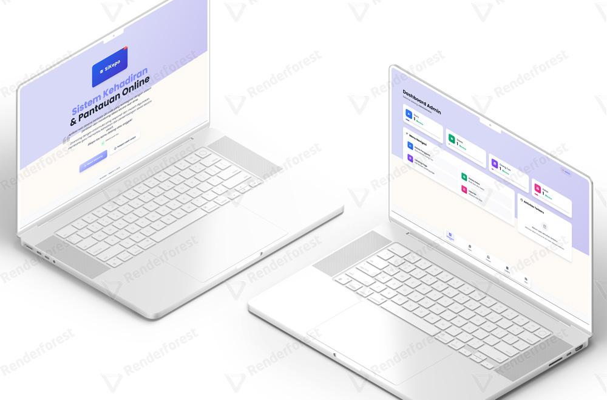
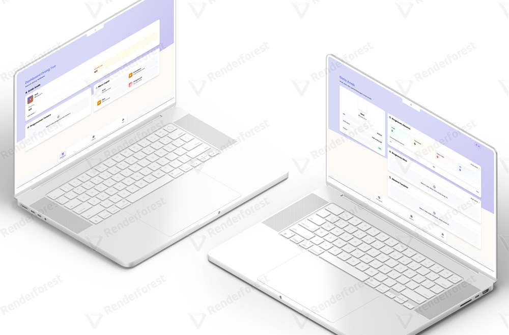
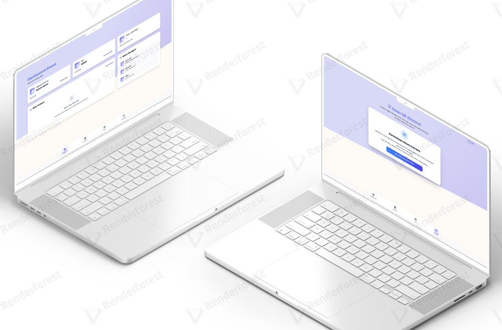
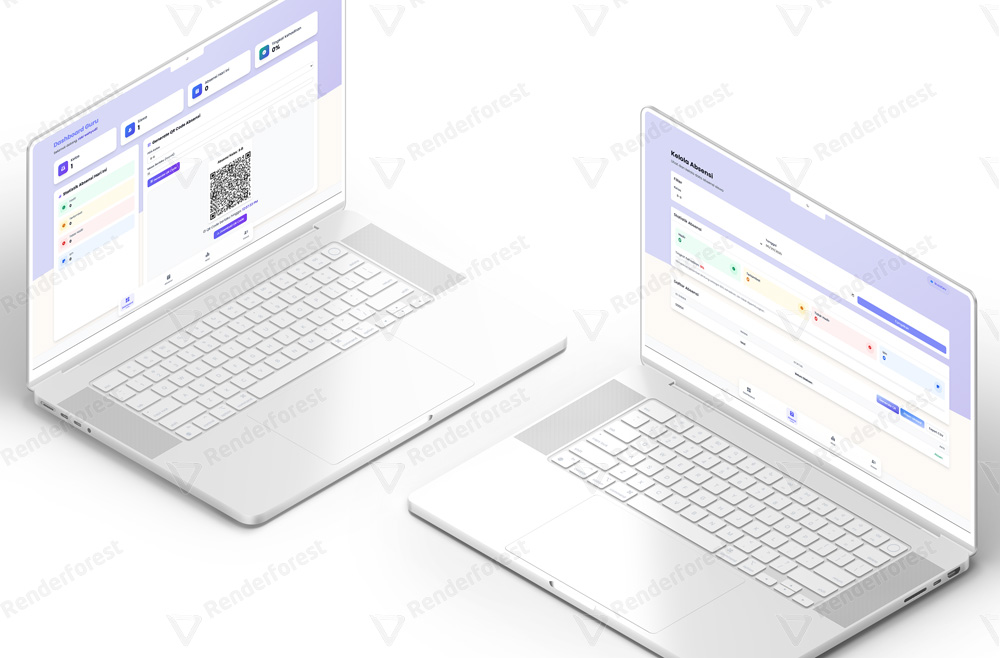

# 📚 SiKePO - Sistem Kehadiran & Pantauan Online
<p align="center">
  
  
  
  
  
</p>

> SiKePO adalah sistem manajemen sekolah modern dengan fitur absensi berbasis QR code, penilaian terintegrasi, dan monitoring siswa secara real-time. Dirancang dengan antarmuka yang responsif dan mudah digunakan, membantu guru dan orang tua memantau kehadiran dan perkembangan siswa secara efektif.

## ✨ Fitur Utama

<table>
  <tr>
    <td>🔍 <b>Absensi QR Code</b></td>
    <td>Generate oleh guru, scan oleh siswa untuk pencatatan kehadiran instan</td>
  </tr>
  <tr>
    <td>👨‍👩‍👧‍👦 <b>Sistem Kelas</b></td>
    <td>Pengelolaan kelas dan wali kelas yang terstruktur</td>
  </tr>
  <tr>
    <td>📊 <b>Penilaian Siswa</b></td>
    <td>Input dan monitoring nilai dengan visualisasi data yang intuitif</td>
  </tr>
  <tr>
    <td>👁️ <b>Monitoring Orang Tua</b></td>
    <td>Akses real-time untuk memantau kehadiran dan nilai anak</td>
  </tr>
</table>

## 🖼️ Preview Mockup

> Preview Mockup dari #SiKePOs

<div align="center">
  
  
  
  
</div>

## 🧩 Teknologi yang Digunakan

- **Backend**: Node.js + Express.js untuk server yang cepat dan efisien
- **View Engine**: Pug templating untuk rendering HTML yang elegan
- **Styling**: Tailwind CSS v4 untuk desain yang modern dan responsif
- **Database**: SQLite3 (file-based) untuk penyimpanan data yang ringan
- **QR Code**: Generator menggunakan easyqrcodejs untuk kehadiran tanpa kontak

## 👥 Role Pengguna

<details>
  <summary><b>🛡️ Admin</b></summary>
  <ul>
    <li>Mengelola data guru, siswa, orang tua</li>
    <li>Mengelola kelas dan menetapkan wali kelas</li>
    <li>Mengelola berita untuk orang tua</li>
    <li>Melihat laporan absensi dan nilai siswa</li>
  </ul>
</details>

<details>
  <summary><b>👨‍🏫 Guru</b></summary>
  <ul>
    <li>Sebagai pengajar atau wali kelas</li>
    <li>Membuat QR code harian untuk absensi</li>
    <li>Menginput nilai siswa</li>
    <li>Melihat data dan perkembangan siswa</li>
  </ul>
</details>

<details>
  <summary><b>👨‍👩‍👧‍👦 Orang Tua</b></summary>
  <ul>
    <li>Melihat absensi dan nilai anak</li>
    <li>Melihat catatan dari guru</li>
    <li>Memantau perkembangan anak secara real-time</li>
  </ul>
</details>

<details>
  <summary><b>👨‍🎓 Siswa</b></summary>
  <ul>
    <li>Melakukan absensi dengan scan QR</li>
    <li>Melihat nilai dan catatan pribadi</li>
    <li>Melihat riwayat kehadiran dan prestasi</li>
  </ul>
</details>

## 🚀 Cara Instalasi

1. Clone repository ini
   ```bash
   git clone https://github.com/IkuzaDev/SiKePO.git
   cd SiKePO
   ```

2. Install dependencies
   ```bash
   npm install
   ```

3. Jalankan aplikasi
   ```bash
   npm start
   ```
   atau untuk development
   ```bash
   npm run dev
   ```

4. Akses aplikasi melalui browser di `http://localhost:3000` atau `https://localhost` jika memiliki sertifikat SSL

## 🔑 Default Login

| Role  | Username | Password  |
|-------|----------|-----------|
| Admin | admin    | admin123  |

## 🗺️ Routes & API Endpoints

<details>
  <summary><b>🔐 Authentication</b></summary>
  
  - `GET /login` - Menampilkan halaman login
  - `POST /login` - Memproses login user
  - `GET /logout` - Logout user dan menghapus token
</details>

<details>
  <summary><b>🏠 Dashboard Routes</b></summary>
  
  - `GET /` - Halaman utama/landing page
</details>

<details>
  <summary><b>🛡️ Admin Routes</b></summary>

  ### Page Routes
  - `GET /admin/dashboard` - Dashboard admin
  - `GET /admin/users` - Manajemen pengguna
  - `GET /admin/classes` - Manajemen kelas
  - `GET /admin/classes/:id/students` - Manajemen siswa dalam kelas
  - `GET /admin/landing-page` - Manajemen landing page
  - `GET /admin/reports` - Laporan
  - `GET /admin/subjects` - Manajemen mata pelajaran
  - `GET /admin/announcements` - Manajemen pengumuman
  - `GET /admin/announcements/add` - Form tambah pengumuman
  - `GET /admin/announcements/edit/:id` - Form edit pengumuman

  ### API Routes - Users
  - `GET /admin/api/users` - Mendapatkan semua data pengguna
  - `GET /admin/api/users/:id` - Mendapatkan data pengguna tertentu
  - `POST /admin/api/users` - Membuat pengguna baru
  - `PUT /admin/api/users/:id` - Mengubah data pengguna
  - `DELETE /admin/api/users/:id` - Menghapus pengguna

  ### API Routes - Classes
  - `GET /admin/api/classes` - Mendapatkan semua data kelas
  - `GET /admin/api/classes/:id` - Mendapatkan data kelas tertentu
  - `POST /admin/api/classes` - Membuat kelas baru
  - `PUT /admin/api/classes/:id` - Mengubah data kelas
  - `DELETE /admin/api/classes/:id` - Menghapus kelas

  ### API Routes - Landing Page
  - `GET /admin/api/landing-page` - Mendapatkan semua konten landing page
  - `GET /admin/api/landing-page/:id` - Mendapatkan konten tertentu
  - `POST /admin/api/landing-page` - Membuat konten baru
  - `PUT /admin/api/landing-page/:id` - Mengubah konten
  - `DELETE /admin/api/landing-page/:id` - Menghapus konten

  ### API Routes - Subjects
  - `GET /admin/api/subjects` - Mendapatkan semua mata pelajaran
  - `GET /admin/api/subjects/:id` - Mendapatkan mata pelajaran tertentu
  - `POST /admin/api/subjects` - Membuat mata pelajaran baru
  - `PUT /admin/api/subjects/:id` - Mengubah mata pelajaran
  - `DELETE /admin/api/subjects/:id` - Menghapus mata pelajaran

  ### API Routes - Announcements
  - `POST /admin/announcements` - Membuat pengumuman baru
  - `POST /admin/announcements/:id` - Mengubah pengumuman
  - `DELETE /admin/api/announcements/:id` - Menghapus pengumuman

  ### API Routes - Students
  - `PUT /admin/api/students/:id/remove-from-class` - Mengeluarkan siswa dari kelas
  - `GET /admin/api/students/byUserId/:userId` - Mendapatkan data siswa berdasarkan ID user
</details>

<details>
  <summary><b>👨‍🏫 Teacher Routes</b></summary>

  ### Page Routes
  - `GET /teacher/dashboard` - Dashboard guru
  - `GET /teacher/attendance` - Manajemen absensi siswa
  - `GET /teacher/students` - Daftar siswa
  - `GET /teacher/grades` - Input nilai siswa

  ### API Routes - Attendance
  - `POST /teacher/api/attendance` - Membuat data absensi baru
  - `PUT /teacher/api/attendance/:id` - Mengubah status absensi
  - `DELETE /teacher/api/attendance/:id` - Menghapus data absensi
  - `POST /teacher/api/attendance/bulk` - Membuat/mengubah banyak data absensi sekaligus

  ### API Routes - Grades
  - `POST /teacher/grades` - Membuat data nilai baru
  - `PUT /teacher/grades/:id` - Mengubah nilai
  - `DELETE /teacher/grades/:id` - Menghapus data nilai
  - `POST /teacher/grades/batch` - Membuat/mengubah banyak data nilai sekaligus
  - `POST /teacher/api/grades` - Membuat data nilai baru (alternatif)
  - `PUT /teacher/api/grades/:id` - Mengubah nilai (alternatif)
  - `DELETE /teacher/api/grades/:id` - Menghapus data nilai (alternatif)
  - `POST /teacher/api/grades/bulk` - Membuat/mengubah banyak data nilai sekaligus (alternatif)
</details>

<details>
  <summary><b>👨‍🎓 Student Routes</b></summary>

  ### Page Routes
  - `GET /student/dashboard` - Dashboard siswa
  - `GET /student/attendance` - Melihat riwayat absensi
  - `GET /student/grades` - Melihat nilai
  - `GET /student/qr-scanner` - Scanner QR code untuk absensi

  ### API Routes
  - `POST /student/api/scan-qr` - Endpoint untuk siswa melakukan scan QR code
</details>

<details>
  <summary><b>👨‍👩‍👧‍👦 Parent Routes</b></summary>

  ### Page Routes
  - `GET /parent/dashboard` - Dashboard orang tua
  - `GET /parent/announcement/:id` - Melihat detail pengumuman
  - `GET /parent/children` - Alias untuk dashboard
  - `GET /parent/child` - Melihat detail anak (dengan query param childId)
  - `GET /parent/child/:id` - Melihat detail anak berdasarkan ID
  - `GET /parent/attendance` - Melihat absensi anak (dengan query param childId)
  - `GET /parent/child/:id/attendance` - Melihat absensi anak berdasarkan ID
  - `GET /parent/grades` - Melihat nilai anak (dengan query param childId)
  - `GET /parent/child/:id/grades` - Melihat nilai anak berdasarkan ID
</details>

<details>
  <summary><b>🌐 Global API</b></summary>
  
  - `POST /api/attendance/scan` - Endpoint umum untuk scan QR code absensi
</details>

## 📂 Struktur Project

```
src/
├── app.js            # File utama aplikasi
├── config/           # Konfigurasi database dan aplikasi
├── controllers/      # Logic aplikasi
├── middleware/       # Middleware Express
├── models/           # Model data
├── routes/           # Route aplikasi
├── views/            # Template Pug
└── public/           # Static assets (CSS, JS, gambar)
```
